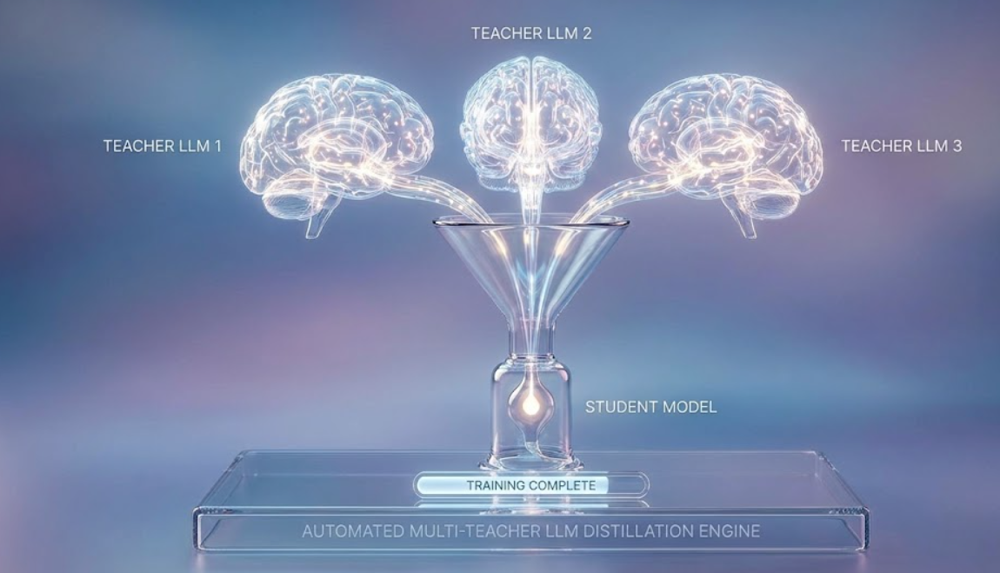

# Automated Multi-Teacher LLM Distillation Engine

<div align="center">
  
</div>

<div align="center">

**Production-ready, fully automated engine** for knowledge distillation from multiple large language models into compact student models.

[](LICENSE)
[](https://www.python.org/downloads/)
[](https://pytorch.org/)
[](https://huggingface.co/)

</div>

---

## ✨ Key Features

**Complete Automation** • **HuggingFace Integration** • **Web UI** • **Multi-Teacher Support** • **Quantization Ready**

## New Features (Automated Engine)

 **Complete Automation**
- Automatic model downloading from HuggingFace Hub
- Support for any HuggingFace model as teacher
- Smart tokenizer alignment and vocabulary management
- Automated dataset loading and preprocessing

 **Flexible Dataset Support**
- HuggingFace datasets (30,000+ datasets available)
- User-uploaded files (JSON, JSONL, CSV, TXT, Parquet)
- Directory scanning for text files
- Automatic validation and preprocessing

 **Easy Configuration**
- YAML/JSON configuration files
- Command-line interface with full options
- Web UI for non-technical users
- Example configs for quick start

 **Advanced Features**
- 4-bit and 8-bit quantization support
- Mixed precision training (FP16/BF16)
- Progress tracking with ETA
- Automatic checkpoint management
- Resume training from checkpoints

## What is Multi-Teacher Distillation?

## Quick Start

### Installation

```bash
# Clone the repository
git clone https://github.com/harsh2025-sketch/multi_teacher_llm_distillation_engine.git
cd multi_teacher_llm_distillation_engine

# Install dependencies
pip install -r requirements.txt

# Or install as package
pip install -e .
```

###  Web UI (Recommended for Beginners)

#### Option 1: Streamlit UI (Modern & Interactive)

Launch the modern Streamlit interface:

```bash
streamlit run src/streamlit_ui.py
```

Then open your browser to `http://localhost:8501`

**Features:**
- 🎨 Modern, intuitive interface
- 📋 Step-by-step configuration wizard
- 📊 Real-time monitoring dashboard
- 💾 Save/load configurations
- 📚 Built-in documentation
- 🎯 Architecture presets

#### Option 2: Gradio UI (Simple & Fast)

Launch the user-friendly Gradio web interface:

```bash
python src/web_ui.py
```

Then open your browser to `http://localhost:7860`

**Features:**
- Visual form for all configurations
- Drag-and-drop dataset upload
- Model selection from HuggingFace
- Real-time training monitoring
- Built-in help and guidance

<div align="center">
  
  <p><em>User-friendly Web UI for configuration and training</em></p>
</div>


## Configuration Reference

<div align="center">
  
  <p><em>Example configuration with all available options</em></p>
</div>


## System Requirements

### Minimum Requirements
- **GPU**: NVIDIA GPU with 16GB+ VRAM (T4, V100)
- **RAM**: 32GB system memory
- **Storage**: 50GB free space
- **CUDA**: 11.8 or higher

### Recommended for Production
- **GPU**: A100 (40GB) or H100 (80GB)
- **RAM**: 64GB+ system memory
- **Storage**: 200GB+ SSD
- **CUDA**: 12.0+

### Memory Usage Estimates

| Configuration | GPU Memory | Training Time (100K samples) |
|---------------|------------|------------------------------|
| 2 Teachers (8-bit) + Small Student | ~14GB | ~6 hours (T4) |
| 2 Teachers (8-bit) + Medium Student | ~16GB | ~10 hours (V100) |
| 2 Teachers (4-bit) + Large Student | ~12GB | ~8 hours (T4) |
| 3 Teachers (8-bit) + Medium Student | ~20GB | ~12 hours (A100) |


```python
from student_architecture import StudentArchitectureConfig, StudentLLM

# Custom configuration
config = StudentArchitectureConfig(
 hidden_size=1024,
 num_hidden_layers=16,
 # ... custom settings
)

model = StudentLLM(config)
```

### Multi-GPU Training

```bash
# Use accelerate for multi-GPU
accelerate config # Configure once

accelerate launch src/cli.py --config my_config.yaml
```

### Export to HuggingFace

```bash
# Convert checkpoint to HuggingFace format
python src/export_to_safetensors.py \
 --in_dir ./outputs/checkpoints/step_10000 \
 --release_dir ./hf_model \
 --max_shard_size 5GB
```

## Monitoring Training

<div align="center">
  
  <p><em>Real-time training progress and metrics</em></p>
</div>

<div align="center">
  
  <p><em>Training completion and model export</em></p>
</div>


## License

Apache License 2.0 - see `LICENSE` file for details
